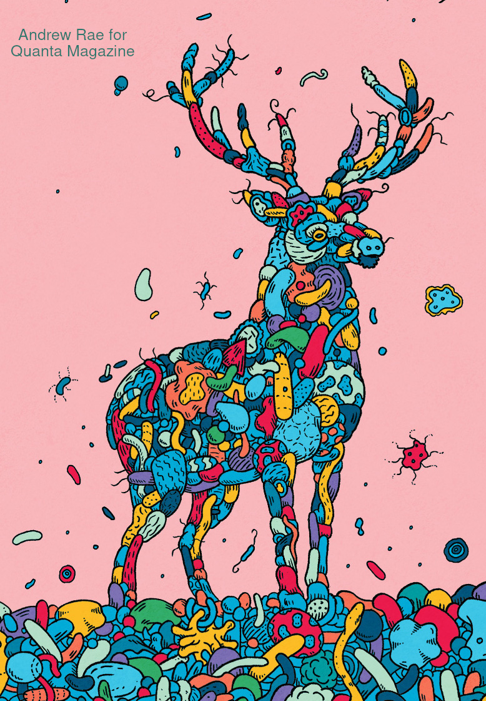

## **The Evolution of   Microbiome-Mediated Traits**

### Bob Week

#### 🐘 @bweek@ecoevo.social

Postdoc, University of Oregon
_Advised by:
Brendan Bohannan,
Peter Ralph, Bill Cresko_

---

## What is a Microbiome-Mediated Trait?

A quantitative character of a host organism with variance explained by variation of the host microbiome

* $P=\textcolor{orange}{G}+\textcolor{lightgreen}{M}$
* $\textcolor{lightgreen}{M}>0$

---

## Host  Trait Architecture
 

$$z=\textcolor{orange}{g}+\textcolor{lightgreen}{m}$$
 

* $\textcolor{orange}{g}\sim$ sum of additive effects across host loci

  * _additive_ genetic value
 

* $\textcolor{lightgreen}{m}\sim$ sum of additive effects across microbe species

  * _additive_ microbial value

---

## Host Life Cycle

---

## Host Trait Evolution
 

* Want: $\Delta\bar z = \bar z'-\bar z$

* Need: $\bar m'$

---

## Microbial Inheritance

* $\textcolor{cyan}{\ell}=$ Lineal inheritance
  
* $1-\textcolor{cyan}{\ell}=$ Environmental acquisition

* $\textcolor{lightgreen}{\varepsilon}=$ Env-Env transmission

* $1-\textcolor{lightgreen}{\varepsilon}=$ Host shedding

* Collective inheritance:

  * $\textcolor{orange}{\kappa}=(1-\textcolor{cyan}{\ell})(1-\textcolor{lightgreen}{\varepsilon})$
 

* $\textcolor{cyan}{\ell}+\textcolor{orange}{\kappa}\leq1$

---

### Microbial Value Inheritance
 

* $\xi, \ \xi' =$ Environmental microbial values
 

* $m'=\textcolor{cyan}{\ell} m+(1-\textcolor{cyan}{\ell})(1-\textcolor{lightgreen}{\varepsilon})\bar m^*+(1-\textcolor{cyan}{\ell})\textcolor{lightgreen}{\varepsilon}\xi$
 

* $\bar m'=(\textcolor{cyan}{\ell}+\textcolor{orange}{\kappa})\bar m^*+(1-\textcolor{cyan}{\ell}-\textcolor{orange}{\kappa})\xi$

---

### The Analytical Model
 

Assuming normally distributed $g,m,z$...
 

* $\Delta\bar z = \textcolor{orange}{G}\beta+\textcolor{lightgreen}{(\ell+\kappa)M}\beta+\textcolor{cyan}{(1-\ell-\kappa)(\xi-\bar m)}$
 

  * $\textcolor{orange}{G}=Var(\textcolor{orange}{g})$

  * $\beta=$ selection gradient

  * $\textcolor{lightgreen}{M}=Var(\textcolor{lightgreen}{m})$
 

* $\Delta\xi=\kappa(\textcolor{lightgreen}{M}\beta+\textcolor{cyan}{\bar m-\xi})/(1-\ell)$

---

<!-- ### Host Trait Evolution Across Transmission Modes

$\small G=0, \ \ M=1, \ \ \beta=1, \ \ \bar z_0=\xi_0=0$

--- -->

### Simulation Model
 

* Finite host population size $N_e$
 

* Explicit microbiome dynamics

  * $m=\sum_{i=1}^S\alpha_in_i$

  * $S \ =$ species richness

---

### Microbiome Dynamics

* Hubbell's neutral model

  * Fixed community size: $\sum_in_i=J_e$

  * $\vec n(t+1)\sim$ Multinomial$(J_e,\vec n(t))$

  * $L$ iterations per host generation

* Source of host trait variation

  * Microbiome analog to mutation

---

### Simulation Setup

* $G_0=M_0=0$

* $L=30$

* $10$ replicates per parameter combination

  * Across $N_e, S, \ell, \kappa$

---

##### Mean Trait Evolution Across $N_e$

$\ell=1$

$\kappa=0$

$S=100$

---

###### Trait Variance Evolution Across $N_e$

$\ell=1$

$\kappa=0$

$S=100$

---

##### Mean Trait Evolution Across $S$

$\ell=1$

$\kappa=0$

$N_e=1000$

---

###### Trait Variance Evolution Across $S$

$\ell=1$

$\kappa=0$

$N_e=1000$

---

##### Mean Trait Evolution Across $\ell,\kappa$

$S=100$

$N_e=1000$

---

###### Trait Variance Evolution Across $\ell,\kappa$

$S=100$

$N_e=1000$

---

### TODO

How well does the analytical model predict the simulation model over a single host generation?

---

### Fin